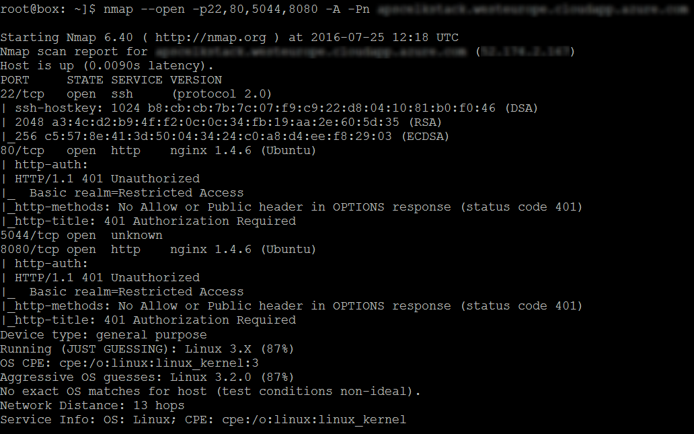
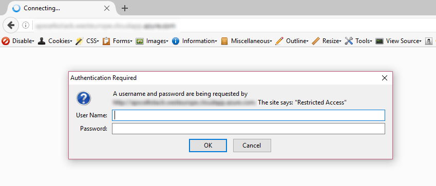
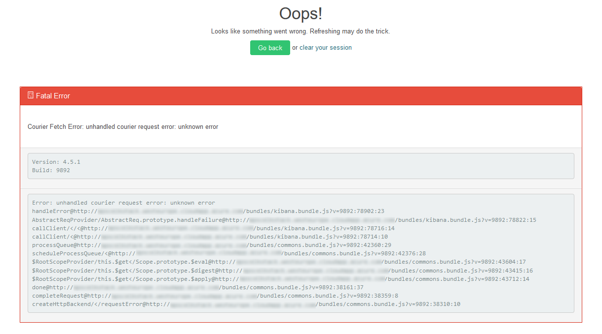
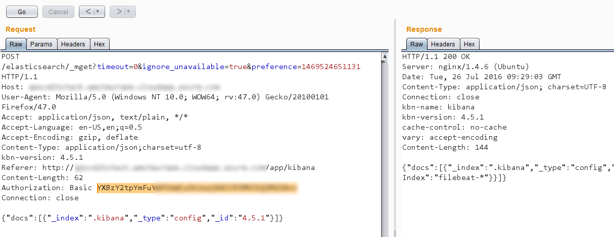

### Pentesting the infrastructure
(what does an attacker see?)

### The Why?
A penetration testing exercise was undertaken to check if there was a possibility of gaining unauthorized access to the setup

### Black Box Penetration Testing

### Port scanning

### Service enumeration

### HTTP basic Auth on ports 80 and 8080

### Attempted brute force
Multiple dictionaries were tried against the HTTP Basic Auth

### Attempted brute force
Multiple dictionaries were tried against SSH as well

## Grey Box Penetration Testing
App credentials were provided

### Verbose Errors

### Credential Leakage through MiTM

Drop us a note if you want the complete pentest report 
contact@appsecco.com